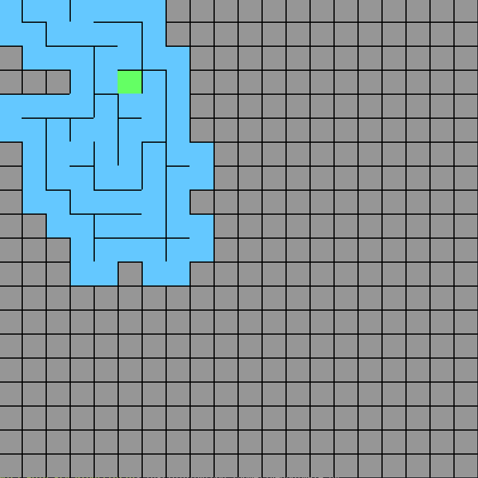
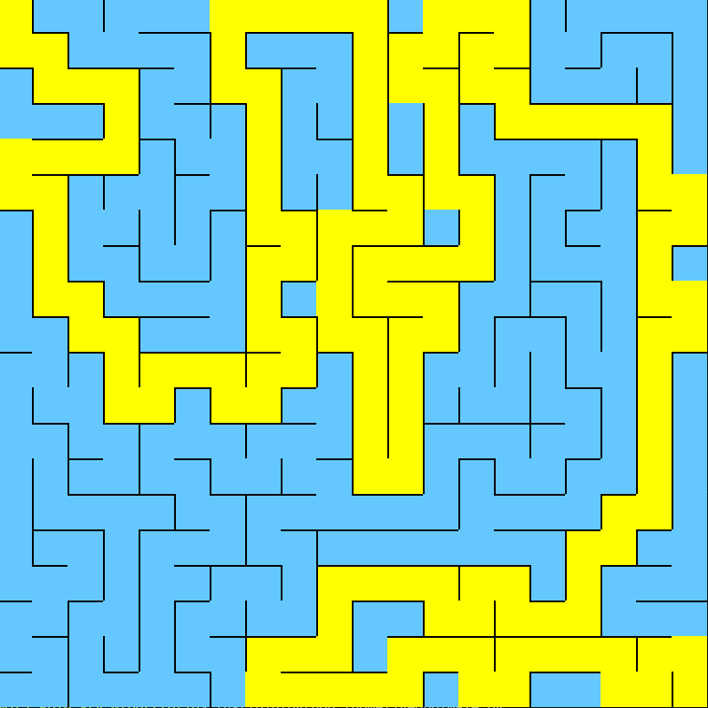

# Maze!
Maze! is a maze generator and solver that uses the famous DFS algorithm.

- The application might crash when starting the solving of the maze. In that case, you can just click "Wait".
- You can find the executable file in `/dist`.

## Tutorial
To start the generation, press ENTER.

To start solving the maze which is only possible after fully generating the maze, press SPACE.

## Screenshots

